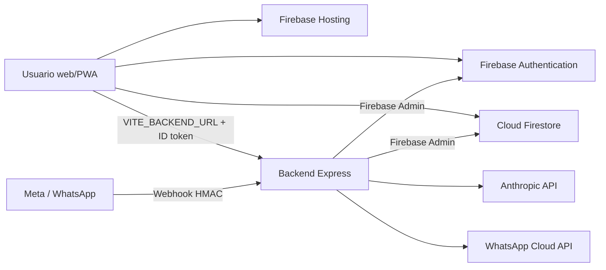

# STACK - SurtiFacil

**Fecha:** 2026-08-28  
**Estado:** Aceptado por el operador el 2026-08-28, con objetivo de costo USD 0  
**Situacion:** Proyecto existente adoptado por Cronos; este documento describe el stack real y propone completar el backend en staging.  
**Plataforma de trabajo detectada:** Codex CLI

## Clasificacion

**Nivel 3 - Empresarial.** SurtiFacil combina POS, inventario, compras, proveedores,
usuarios y roles, reportes financieros, PWA e integraciones con WhatsApp y un API de IA.
Manipula datos operativos y financieros y tiene varios modulos con reglas de acceso distintas.

Se activa el ciclo completo de autocritica de Cronos: seguridad, QA avanzada y rendimiento
antes de una release grande. Las skills avanzadas de arquitectura, datos, integraciones y
gobernanza aplican cuando se toque cada area. El framework Superpowers no se declara activo:
el core actual solo lo considera verificado para OpenCode, no para Codex CLI.

## Stack real

| Capa | Tecnologia actual | Responsabilidad |
|---|---|---|
| Frontend | TypeScript, React 18, Vite 6, Tailwind CSS 3, Recharts | SPA administrativa, POS y PWA |
| Backend | Node.js >=22, CommonJS, Express 4 | API autenticada, ventas transaccionales, usuarios, WhatsApp y proxy de IA |
| Identidad | Firebase Authentication | Inicio de sesion e ID tokens |
| Datos | Cloud Firestore + Firebase Admin SDK | Persistencia operacional y autorizacion server-side |
| Hosting web | Firebase Hosting | Publicacion de `web/dist` con HTTPS |
| Integraciones | WhatsApp Cloud API y Anthropic API | Mensajeria y analisis de imagenes |
| Pruebas | Vitest, Node test runner, Playwright, Firebase Emulator Suite | Unitarias, integracion, reglas y E2E |
| Repositorio | Monorepo con `web/`, `backend/` y `qa/` | Versionado y cambios coordinados |

## Arquitectura actual

Firebase Hosting no ejecuta `backend/`. El frontend y el backend son artefactos distintos y
deben desplegarse por separado. El bundle web de produccion debe recibir una URL HTTPS real en
`VITE_BACKEND_URL`; un valor `localhost` invalida la release.

## Decisiones de arquitectura

### 1. Mantener un monolito modular

**Decision:** conservar un unico servicio Express con modulos delimitados mientras no existan
necesidades demostradas de escalado, despliegue o propiedad independiente.

**Alternativas consideradas:**

- Microservicios por modulo: descartados por ahora; no hay equipos ni ciclos de despliegue
  independientes que compensen la complejidad operativa.
- Arquitectura event-driven general: descartada; no hay varios consumidores reales para cada
  evento. Una cola se evaluara solo para trabajos lentos o reintentos concretos.

### 2. Separar los artefactos web y backend

**Decision:** mantener la SPA en Firebase Hosting y desplegar Express como servicio Node separado.

**Alternativas consideradas:**

- Empaquetar la SPA dentro de Express: descartado porque elimina el CDN y el flujo de releases de
  Firebase Hosting sin resolver un problema actual.
- Reescribir todo como funciones: descartado porque obliga a adaptar el servidor y sus rutas sin
  una ganancia demostrada.

### 3. Usar Cloud Run para el backend con estrategia free-tier-first

**Decision aceptada:** preparar un solo contenedor del backend Express para Cloud Run, primero en
un proyecto de staging separado y con cero instancias minimas. El objetivo operativo es permanecer
en el free tier y pagar USD 0; los presupuestos aprobados son techos de seguridad, no metas de gasto.
La decision queda registrada en `docs/adr/0002-cloud-run-para-backend.md`.

| Ruta | Baja friccion | Seguridad | Reversibilidad | Repetibilidad | Resultado |
|---|---:|---:|---:|---:|---|
| Cloud Run free tier | 4/5 | 5/5 | 5/5 | 5/5 | Elegida: conserva Express, escala a cero y usa identidad de servicio |
| Render Free | 4/5 | 3/5 | 4/5 | 4/5 | Solo staging experimental; duerme tras 15 minutos y no se recomienda para produccion |
| Cloudflare Workers Free | 2/5 | 4/5 | 3/5 | 4/5 | Exige adaptar Express/Firebase Admin y validar limites de CPU del runtime |

Cloud Run no garantiza costo cero si se superan sus cuotas, por eso se conserva el techo aprobado y
se medira el consumo. Su salida sigue siendo reversible: el artefacto es un contenedor Node estandar y puede
moverse a otro runtime compatible. Cloud Run aporta revisiones inmutables, reparto de trafico y
rollback sin separar prematuramente el backend en varios servicios.

### 4. Mantener la autoridad de acceso en el documento de usuario

Se mantiene la decision aceptada en `docs/adr/0001-custom-claims-autorizacion.md`: el documento
protegido `/users/{uid}` es la autoridad en Firestore Rules; los custom claims son datos derivados.

## Entornos y despliegue objetivo

| Entorno | Frontend | Backend | Firebase/datos | Estado |
|---|---|---|---|---|
| Local | Vite | Node/Express | Emuladores Auth/Firestore cuando aplica | Disponible |
| Staging | Hosting preview o sitio separado | Cloud Run, 0 instancias minimas | Proyecto Firebase/GCP separado | Propuesto, no creado |
| Produccion | Firebase Hosting | Cloud Run | Proyecto `smartmarket-b37ce` | Frontend publicado; backend publico no completado |

La region de Cloud Run debe elegirse despues de confirmar la ubicacion real de Firestore y las
restricciones de datos. No se inventa una region por defecto porque una mala eleccion aumenta
latencia, egreso y dificultad de cumplimiento.

## Gestion de secretos e identidad

- Las variables `VITE_FIREBASE_*` y `VITE_BACKEND_URL` son configuracion de build del frontend;
  ningun secreto de proveedor puede llevar el prefijo `VITE_`.
- En Cloud Run, Firebase Admin debe usar Application Default Credentials mediante una identidad de
  servicio con minimo privilegio. No se copiara `serviceAccountKey.json` dentro de la imagen.
- Los tokens de Anthropic y WhatsApp, el secreto HMAC y el token de verificacion deben residir en un
  gestor de secretos y exponerse al proceso con permisos acotados.
- En local, los secretos viven solo en archivos ignorados por Git o en variables temporales. Nunca
  se imprimen en logs, fixtures ni documentacion.
- Staging y produccion deben tener identidades, secretos y datos separados.

## Costo

Las cifras siguientes son ordenes de magnitud, no una cotizacion. Se basan en un staging de bajo
trafico, `min-instances=0`, solicitudes cortas y sin cargas masivas. Deben recalcularse con la region
y el volumen reales antes de habilitar facturacion.

| Servicio | Estimacion mensual inicial | Control de gasto/alerta |
|---|---:|---|
| Cloud Run staging | Objetivo USD 0; techo aprobado USD 10. Free tier con `min-instances=0` y poco uso; egreso aparte | No verificado. Propuesta aprobada: spend cap de USD 10 y alerta del proyecto |
| Firebase Hosting + Firestore | USD 0 mientras permanezca dentro de cuotas; variable por lecturas, almacenamiento y egreso | No verificado. Tratar como ausente hasta obtener evidencia |
| Artifact Registry, Cloud Build y Logging | USD 0-5 con una imagen pequena y pocos despliegues | Cubiertos por el presupuesto global de GCP; revisar retencion de logs |
| Anthropic API | Variable por tokens. Ejemplo: 10.000 analisis de 2.000 tokens de entrada y 500 de salida con Sonnet 4.6 rondan USD 135 | No verificado. Mantener deshabilitado en staging hasta fijar modelo, cuota y presupuesto |
| WhatsApp Cloud API | Variable por pais, categoria y volumen; no estimable responsablemente sin esos tres datos | No verificado. Medir volumen y confirmar limite antes de trafico real |

**Hallazgo de costo alto:** Cloud Run, Firestore, Anthropic y WhatsApp no tienen alertas o topes
verificables desde el repositorio. Una alerta normal de Google Cloud informa, pero no corta el gasto.
Cloud Run aparece como servicio elegible para spend caps en vista previa; aun asi puede existir
latencia de reporte y sobrecosto. Configuracion aprobada para staging: objetivo USD 0,
`min-instances=0`, spend cap de Cloud Run en USD 10/mes, presupuesto global de GCP en USD 25/mes con
alertas 50/80/100%, y APIs externas deshabilitadas hasta aprobar sus presupuestos por separado.

## Calidad y pruebas

| Alcance | Herramienta/comando | Baseline validada el 2026-08-28 |
|---|---|---|
| Frontend unitario | `npm test` dentro de `web/` | 216/216 pasan |
| Backend unitario | `npm test` dentro de `backend/` | 75/75 pasan |
| Reglas | Firebase Emulator Suite + `qa/tests/firestore-rules.cjs` | Pasa con Java 21 |
| Venta transaccional | Emulador Firestore + `qa/tests/sales-transaction.cjs` | Pasa |
| E2E | Playwright | 4/4 pasan con cuentas mock locales dedicadas; no requiere secretos ni servicios pagos |
| Build | TypeScript + Vite | Pasa con advertencias de chunks |

Antes de una release Nivel 3 se requieren tambien cobertura medible, casos de contrato, carga sobre
los caminos criticos y una corrida E2E autenticada sin omisiones relevantes.

## Observabilidad

- `GET /api/health` es el chequeo basico actual.
- Staging debe agregar logs estructurados sin PII ni secretos, correlacion por request y alertas de
  errores/latencia antes de promover a produccion.
- Se deben definir SLO iniciales de disponibilidad y latencia despues de medir el baseline real;
  no se fijan numeros sin evidencia.

## Prerrequisitos antes del primer staging

1. Aprobado el 2026-08-28: este `STACK.md`, el Nivel 3 y el ADR-0002 con objetivo USD 0.
2. Crear una tarea para inicializar Firebase Admin con ADC en Google y conservar un mecanismo local
   seguro; ejecutar pruebas de backend y emuladores despues del cambio.
3. Crear un `Dockerfile`/`.dockerignore` reproducible, fijar la version de Node y verificar que el
   contenedor atiende en `PORT` como usuario no privilegiado.
4. Sustituir el modelo Anthropic retirado por un modelo vigente solo despues de aprobar costo y
   calidad; mantener el endpoint deshabilitable.
5. Configurar identidad de servicio con minimo privilegio y gestor de secretos.
6. Crear proyecto de staging separado, presupuesto y alertas. Esto requiere confirmacion explicita
   porque habilita infraestructura con facturacion potencial.
7. Desplegar una revision sin trafico, verificar `/api/health`, autenticacion, CORS, webhook HMAC y
   ventas contra staging; luego promover trafico de staging.
8. Construir el frontend de staging con su `VITE_BACKEND_URL` HTTPS y fallar el build si una release
   de produccion contiene `localhost`.
9. Documentar rollback a la revision anterior y conservar el artefacto probado.

## MCPs y herramientas auxiliares

- Graphify se usa para trazar dependencias del repositorio y validar decisiones de arquitectura.
- Playwright CLI esta disponible para E2E. La reutilizacion de una sesion de navegador autenticada
  no se asume ni se necesita para aprobar este documento.
- No se requiere un MCP externo para crear staging; las acciones cloud se ejecutaran solo despues
  del checkpoint y con evidencia de identidad/proyecto objetivo.

## Fuentes de la propuesta

- Firebase Admin recomienda Application Default Credentials en entornos Google, incluido Cloud Run:
  https://firebase.google.com/docs/admin/setup
- Cloud Run permite revisiones, despliegues graduales y rollback:
  https://cloud.google.com/run/docs/rollouts-rollbacks-traffic-migration
- Precios y free tier de Cloud Run:
  https://cloud.google.com/run/pricing
- Cuotas y facturacion de Firestore:
  https://firebase.google.com/docs/firestore/pricing
- Presupuestos y limites de Google Cloud:
  https://cloud.google.com/billing/docs/how-to/budgets
- Precios de Anthropic:
  https://platform.claude.com/docs/en/about-claude/pricing
- Limitaciones oficiales de Render Free:
  https://render.com/docs/free
- Precios y limites de Cloudflare Workers Free:
  https://developers.cloudflare.com/workers/platform/pricing/
  https://developers.cloudflare.com/workers/platform/limits/

## Checkpoint aprobado

El operador confirmo explicitamente el 2026-08-28:

1. La clasificacion **Nivel 3** y el ciclo completo de autocritica.
2. **Cloud Run free-tier-first** como destino del unico backend Express.
3. Un **proyecto de staging separado**, objetivo **USD 0**, y techos de seguridad de
   **USD 10/mes para Cloud Run** y **USD 25/mes para el conjunto GCP de staging**.

Esta aprobacion habilita preparar codigo y backlog, pero no autoriza crear infraestructura,
habilitar facturacion ni desplegar. Esas acciones conservaran sus checkpoints explicitos.
